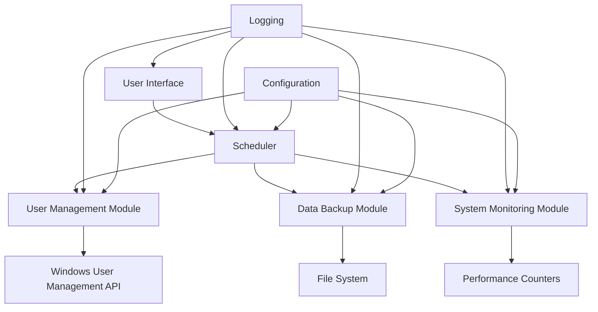
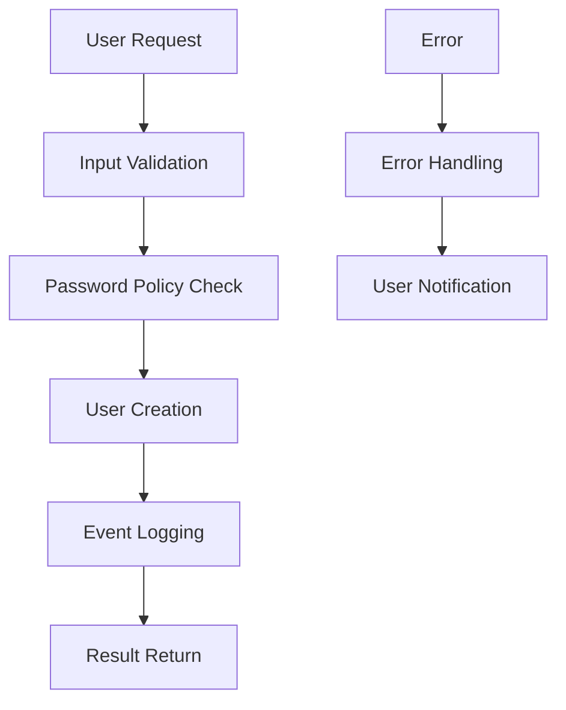
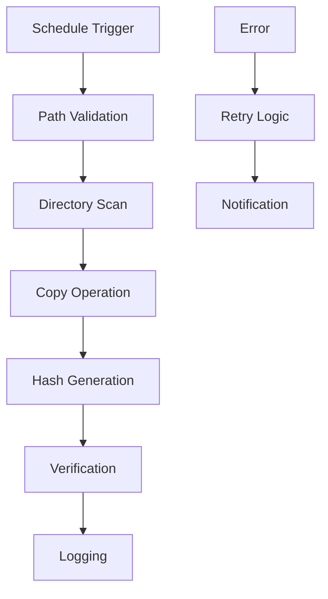
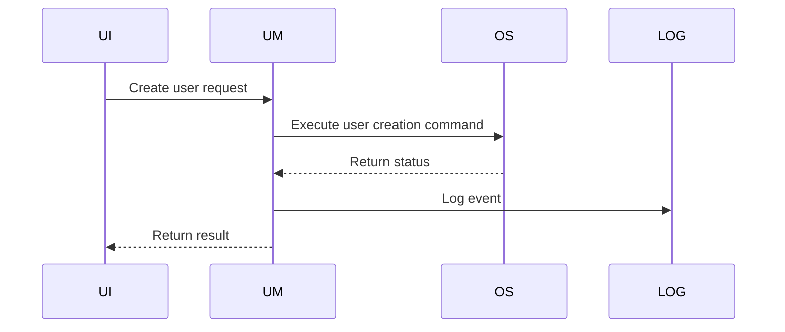
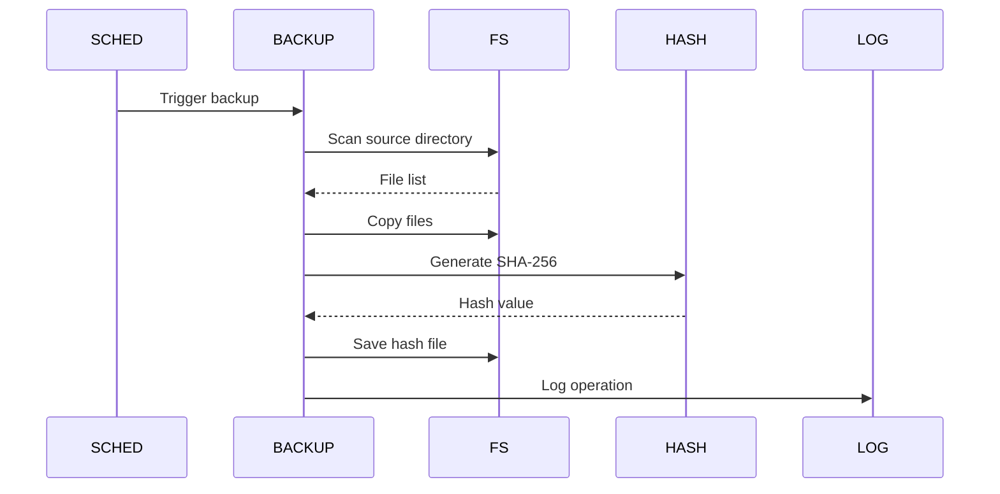
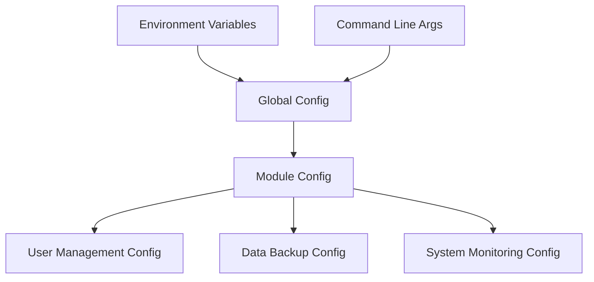
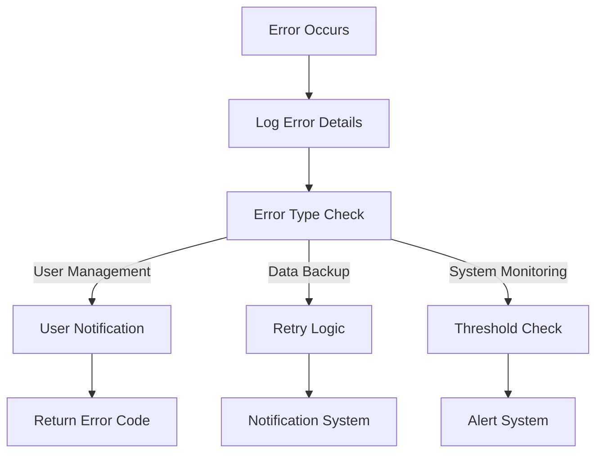

# Python Scripting for System Automation - Architecture

## 1. System Overview
This architecture document describes the design of the Python Scripting for System Automation system, which provides automated solutions for common system administration tasks including user management, data backup, and system monitoring.

## 2. High-Level Architecture

## 3. Component Architecture
### 3.1 User Management Module

### 3.2 Data Backup Module

## 4. Data Flow
### 4.1 User Management Data Flow

### 4.2 Backup Process Data Flow

## 5. Configuration Architecture
### 5.1 Configuration Hierarchy

## 6. Error Handling Architecture

## 7. Security Architecture
### 7.1 Security Controls
| Control | Implementation |
|--------|----------------|
| Authentication | Windows integrated security |
| Authorization | UAC elevation required |
| Data Protection | Encrypted logging, secure password handling |
| Audit | Comprehensive event logging |
| Input Validation | Strict parameter checking |

## 8. Scalability Considerations
- Modular design allows for easy addition of new automation modules
- Configuration-driven approach supports different deployment scenarios
- Resource monitoring prevents system overload
- Standardized interfaces enable future integration with SIEM systems
