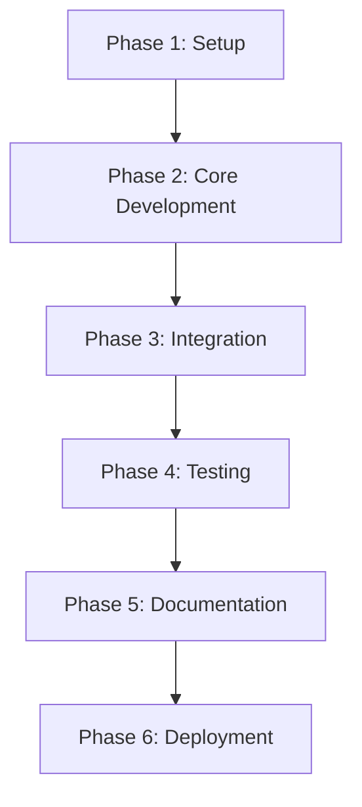

# Python Scripting for System Automation - Implementation Plan

## 1. Project Phases


## 2. Phase 1: Setup & Requirements (Week 1)
### 2.1 Environment Configuration
```powershell
# Create project structure
mkdir "Python Scripting for System Automation"
cd "Python Scripting for System Automation"
mkdir scripts config docs utils tests

# Create virtual environment
python -m venv venv
.\venv\Scripts\pip install --upgrade pip
.\venv\Scripts\pip install python-dotenv argparse psutil schedule
```

### 2.2 Requirements Specification
| Requirement | Description |
|-----------|-------------|
| OS Support | Windows 10/11, Server 2016+ |
| Python Version | 3.9+ |
| Core Libraries | os, subprocess, psutil, schedule |
| Logging Standard | ISO 8601 timestamps, log levels |

## 3. Phase 2: Core Module Development (Week 2-3)
### 3.1 User Management Module
```python
# scripts/user_mgmt.py
import os
import subprocess
from utils.common_utils import log_event

def create_user(username, password):
    """Create a new system user with logging"""
    try:
        subprocess.run(['net', 'user', username, password, '/add'], 
                      check=True, capture_output=True)
        log_event(f"User {username} created successfully")
        return True
    except subprocess.CalledProcessError as e:
        log_event(f"User creation failed: {e.stderr.decode()}", "ERROR")
        return False
```

### 3.2 Data Backup Module
```python
# scripts/data_backup.py
import shutil
import hashlib
from datetime import datetime
from utils.common_utils import validate_path

def create_backup(source_dir, backup_dir):
    """Create timestamped backup with SHA-256 verification"""
    if not validate_path(source_dir) or not validate_path(backup_dir):
        return False
        
    timestamp = datetime.now().strftime("%Y%m%d_%H%M%S")
    backup_path = os.path.join(backup_dir, f"backup_{timestamp}")
    
    try:
        shutil.copytree(source_dir, backup_path)
        # Generate verification hash
        with open(f"{backup_path}.sha256", 'w') as f:
            f.write(hashlib.sha256(open(backup_path, 'rb').read()).hexdigest())
        return backup_path
    except Exception as e:
        print(f"Backup failed: {str(e)}")
        return False
```

## 4. Phase 3: Integration (Week 4)
### 4.1 Scheduler Integration
```python
# scripts/scheduler.py
import schedule
import time
from scripts.data_backup import create_backup
from scripts.system_monitor import check_system_resources

# Daily backup at 2:00 AM
schedule.every().day.at("02:00").do(
    create_backup, 
    source_dir="C:/data",
    backup_dir="D:/backups"
)

# Resource check every 15 minutes
schedule.every(15).minutes.do(check_system_resources)

while True:
    schedule.run_pending()
    time.sleep(1)
```

## 5. Phase 4: Testing (Week 5)
### 5.1 Test Matrix
| Test Type | Module | Method |
|----------|--------|--------|
| Unit Test | User Management | Mock user creation attempts |
| Integration Test | Backup + Scheduler | Scheduled backup execution |
| Stress Test | System Monitor | Resource overload simulation |
| Security Test | All Modules | Permission validation |

## 6. Phase 5: Documentation (Week 6)
### 6.1 Documentation Standards
- All documentation follows SIEM project style
- Mermaid diagrams for architecture and workflows
- API documentation for all public functions
- Version control in document headers

## 7. Phase 6: Deployment (Week 7)
### 7.1 Deployment Checklist
- [ ] Create installation package:
```bash
python -m pip install pyinstaller
pyinstaller --onefile scripts/user_mgmt.py
pyinstaller --onefile scripts/data_backup.py
```

- [ ] Configure Windows services:
```powershell
# Create service for scheduler
New-Service -Name "PyAutomation" `
            -BinaryPathName "C:\Python Scripting for System Automation\scripts\scheduler.exe" `
            -DisplayName "Python Automation Service" `
            -StartupType Automatic
```

## 8. Success Criteria
- [ ] All modules pass unit tests
- [ ] Integration tests verify workflow automation
- [ ] Documentation complete and reviewed
- [ ] System resource usage < 5%
- [ ] Successful deployment on target systems
